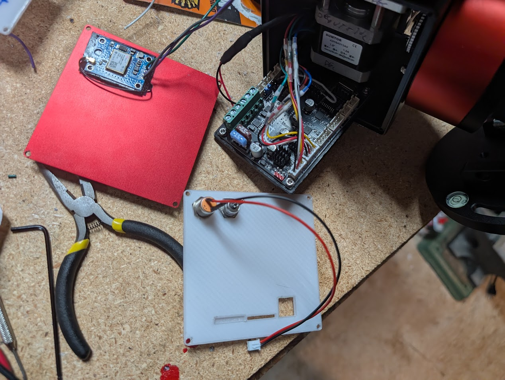

## Juwei-17 mount with Fysetc E4 board

Notes on the process.

Here's a picture of how the board should look while installing. (Ignore the GPS module - you can use one but for this config.h I assumed no GPS connected - just stock juwei hardware)

## Seting up web
Default SSID is OnStepX, password is "password".  It will serve its webpage from http://192.168.0.1
OnstepX is version 10.24c

## 3d printed panels

Based on the excellent existing models - but tweaked to fit the RA brake and not require metal inserts for threads.  Editable [here](https://cad.onshape.com/documents/fcc42821c80392797101e68e/w/b736561701c3a8da688b9f02/e/3aa2c8209cb73604b21e2f7d?renderMode=0&uiState=6a6281e563834c4461102bc8), or the STLs are [here](juwei).

## Building the firmware

** VERY IMPORTANT *** 
Newer ESP32 Arduino library, downgradeESP32 Expressif library to version 2.0.17. If you don't do this the motors just hum - they
don't actually move.  Also be very careful to use the other specific versions mentioned in the Onstep E4 link below.

Alternatively use this slick web builder (upload this config) but make sure to set the target type as E4.
If you need to run the flasher locally (because web version doesn't work) use esptool and go to the github action output 
to download the full image (including bootloader).  Then you can flash at address zero.

## wiring

* The stock Juwei steppers just plug into the E4 board with no need for pin swapping.
* plug the old power switch into XMIN - so it can serve as an emergency stop button
* attach GPS to YMIN (signal to GPS TX, gnd to gnd).  Attach GPS Vcc to any of the 5V pins on the board
* Cut the connector off of the 'brake' cable and hook the brake wires to the +/- "HEATER" output - which is reconfigured in firmware
be brake enable.
* Connect the power connector to the two +/- Power in screw terminals.

## ASCOM driver

Use version 1.0.43 of the ascom driver.

## Hand controller

The stock juwei hand controller can probably be reflashed with https://onstep.groups.io/g/main/wiki/7152 to control the E4 via wifi instead of the ST4 port.  But I haven't investigated/bothered.

* Original awesome post https://www.cloudynights.com/forums/topic/918425-juwei-17-mounts-on-aliexpress/page/47/#findComment-14059463
* Old E4 firmware branch info https://onstep.groups.io/g/main/wiki/32794
* General onstep firmware info https://onstep.groups.io/g/main/wiki/32776
* Onstep Fysetc E4 info https://onstep.groups.io/g/main/wiki/32747
* E4 mfg wiki https://wiki.fysetc.com/docs/E4
* mfg gpio assignments https://github.com/FYSETC/FYSETC-E4
* Used this GPS module: https://www.amazon.com/Coliao-GY-NEO6MV2-NEO6MV2-Control-Antenna/dp/B0DBPTWY8J
* with GPS antenna recommended 7cm ground plane https://avrproject.ru/EB-500/GPS_Antennas_ApplicationNote-GPS-X-08014-.pdf
* why longitude is inverted https://onstep.groups.io/g/main/topic/negative_longitude_values/99160170

## Excellent reverse engineering

from https://www.cloudynights.com/forums/topic/918425-juwei-17-mounts-on-aliexpress/page/21/#entry13665973

RA: sumtor 42HS4013A4 1.8 degrees (200 steps) (NEMA17) (1.3a)
DEC: sumtor 42HS4013B4 1.8 degrees (200 steps) (NEMA17) (1.3a)

Motor Drivers: TMC2208 or TMC2209 MAX microsteps: 256 (We have seen both) (Configured to 16 microsteps)
  I think these were 2A max, the drivers aren't configurable on the stock board

Slew speed: 2.6 degrees per second (configurable, but depends on motor drivers being able to handle the speed)

RA Tracking Accuracy: 1.44 arc-sec
DEC Tracking Accuracy: 1.44 arc-sec

... Now, I am currently installing a Fysetc E4 board into my juwei-17 mount. It doesn't make a significant difference to the hardware, but does give me configurability of the stepper drivers and if you want, there are more hardware options.

E4 changes:
Motor Drivers: TMC2209 MAX microsteps:256

I plan to experiment with different microsteps, but lets assume 64 microsteps:
RA Tracking Accuracy: .86 arc-sec
DEC Tracking Accuracy: .86 arc-sec

The absolute highest you can go is 256, which would get you a .75 arcsecond accuracy, but you sacrifice slew speed.

